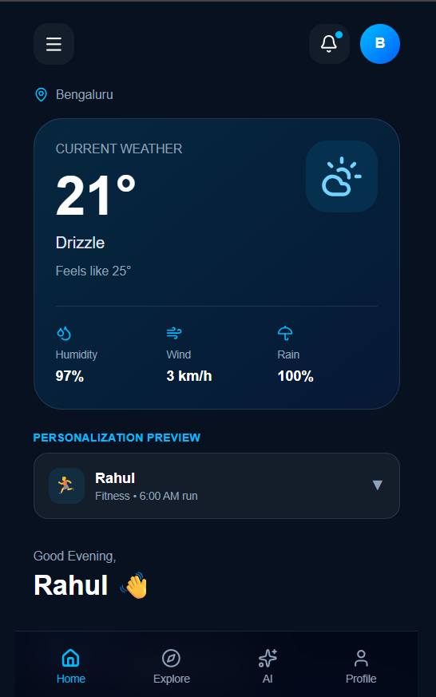
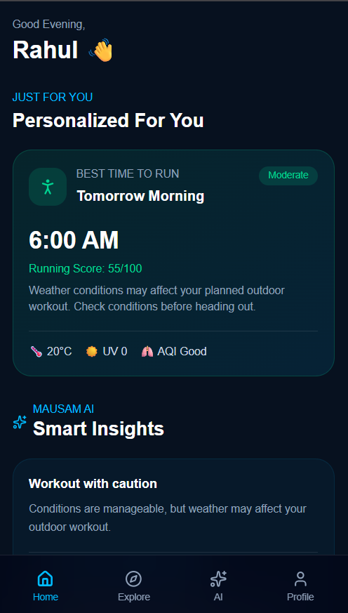
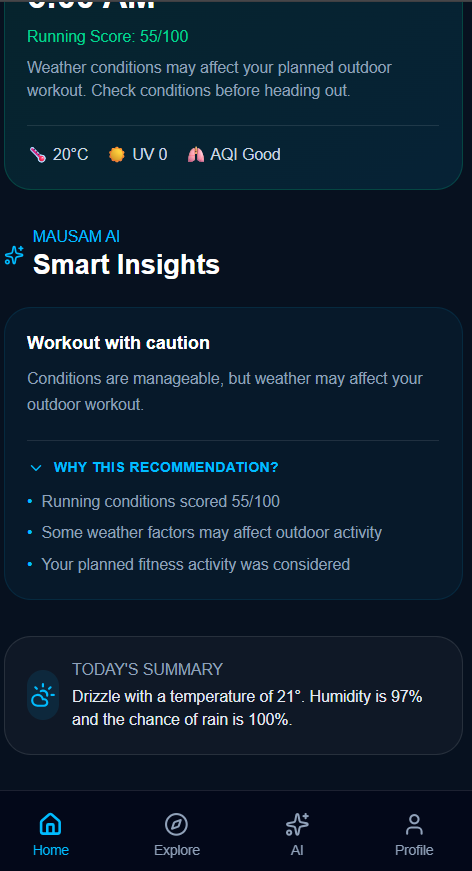
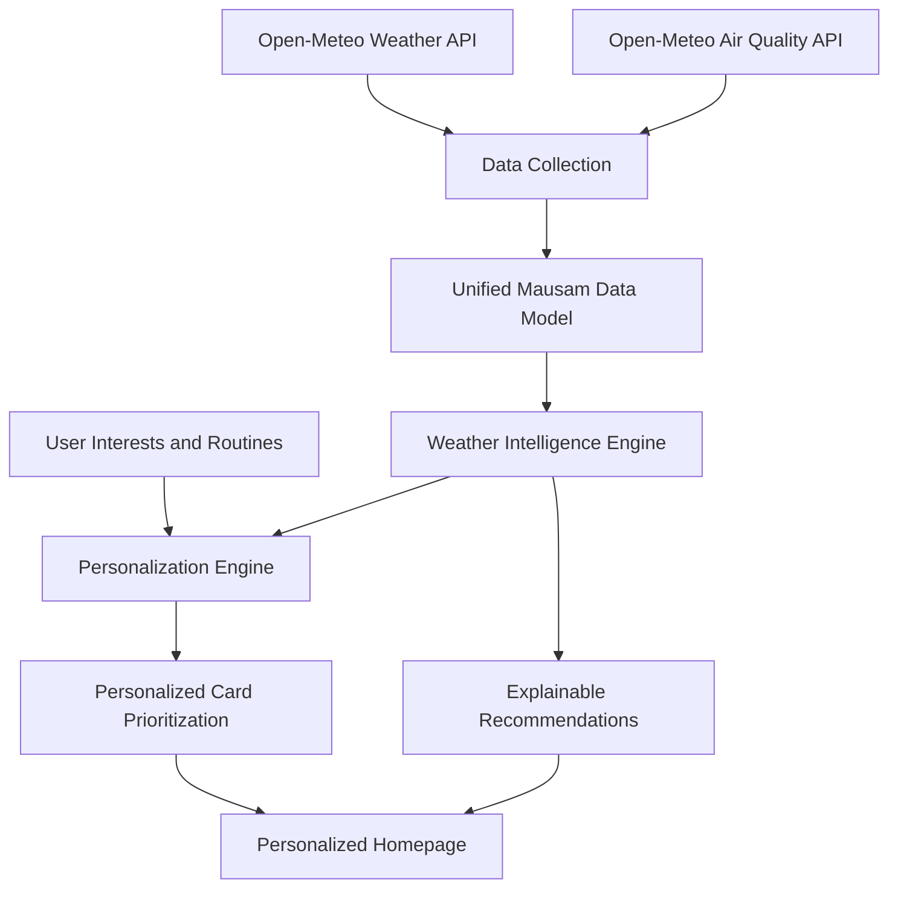

# 🌦️ Mausam AI

### Personalized Weather Intelligence & Decision Support

**Smart India Hackathon 2026 | Team WeatherWardens**

> Turning weather forecasts into personalized, actionable decisions.

Mausam AI is a personalized weather intelligence application that transforms weather and air-quality data into actionable insights based on a user's interests, daily routines, and environmental conditions.

Instead of displaying identical weather information to every user, Mausam AI prioritizes relevant insights for fitness enthusiasts, health-conscious individuals, commuters, and other users.

The project demonstrates how weather information can be transformed into meaningful, explainable, and personalized decisions through a combination of live environmental data, rule-based intelligence, and user-context-aware recommendations.

---

## 🚀 Live Demo

| Resource | Link |
|---|---|
| Live Application | [Mausam AI](https://mausam-ai-weatherwardens.vercel.app/) |
| GitHub Repository | [mausam-ai-weatherwardens](https://github.com/bina26/mausam-ai-weatherwardens) |
| Demo Video | To be added |

**Try it live:** Switch between Rahul, Priya, Arjun, and Binayak to explore how the homepage adapts to different user interests and routines.

---

## 📸 Application Screenshots

### 1. Live Weather Dashboard

Displays current weather conditions, temperature, humidity, wind speed, and precipitation probability.



### 2. Personalized Weather Intelligence

Demonstrates how weather recommendations and dashboard content adapt to different user profiles and routines.



### 3. Smart Insights and Explainable Recommendations

Displays personalized recommendations along with explanations of the weather conditions and factors considered by the recommendation engine.



---

## 🎯 Problem Statement

Traditional weather applications primarily display general-purpose weather information such as temperature, humidity, wind speed, and precipitation forecasts.

However, different users have different weather-related needs.

- A fitness enthusiast wants to know whether conditions are suitable for an outdoor workout.
- A commuter needs to understand potential weather disruptions during their journey.
- A health-conscious user wants to understand air quality and its implications for outdoor activities.
- A user with a fixed daily routine needs weather information relevant to specific times of the day.

Presenting the same information to every user makes it difficult to identify the weather information most relevant to their daily decisions.

### Our Objective

To develop a personalized weather homepage that prioritizes weather intelligence according to user preferences, interests, and daily routines, helping users make informed decisions using environmental data.

---

## 💡 Our Solution

Mausam AI acts as a personalized weather decision-support layer on top of weather and air-quality data.

The application collects environmental data, processes it through a weather intelligence engine, and generates personalized cards and recommendations.

### Core Concept

**Same weather data + different user context = different personalized insights.**

| User Profile | Personalized Information |
|---|---|
| Fitness-focused user | Running suitability, morning workout conditions, and running score |
| Health-focused user | Air-quality status, AQI, and outdoor exposure guidance |
| Commuter | Commute weather risk, rain probability, and travel-related suggestions |
| Combined profile | A personalized combination of fitness, health, and commute insights |

The current prototype demonstrates this behavior through a selectable demo-user interface.

The application is designed to prioritize relevant information rather than simply display raw weather measurements.

---

## ✨ Key Features

### 1. Live Weather Dashboard

- Current temperature and apparent temperature.
- Humidity and wind speed.
- Current weather conditions.
- Precipitation probability.
- Weather information for Bengaluru in the current prototype.
- Integration with live weather data from Open-Meteo.

### 2. Personalized Homepage

- Multiple selectable demo-user profiles.
- Interest-based card selection.
- Dynamic prioritization of weather information.
- Personalized dashboard content based on user context.
- Different recommendation experiences for fitness, health, and commute-focused users.

### 3. Running Suitability Intelligence

- Evaluates weather conditions for outdoor running.
- Considers temperature, humidity, wind speed, rain probability, UV index, and AQI.
- Generates a running suitability score from 0 to 100.
- Provides a status based on implemented scoring rules.
- Supports routine-based morning forecast selection.
- Displays contextual information to help users understand outdoor workout conditions.

### 4. Commute Risk Intelligence

- Evaluates forecast conditions around the configured commute time.
- Considers rain probability, wind speed, weather condition, and visibility.
- Generates a commute risk score and risk category.
- Displays contextual commute recommendations.
- Helps users identify weather conditions that may affect their planned journey.

### 5. Air-Quality Intelligence

- Retrieves air-quality information from Open-Meteo.
- Displays AQI, PM2.5, PM10, ozone, and UV index.
- Categorizes air quality using implemented thresholds.
- Provides recommendations based on available environmental conditions.

### 6. Explainable Recommendations

Every recommendation is supported by the factors considered by the current rule-based engine.

Examples include:

- Running suitability scores and weather factors.
- Commute risk levels and relevant forecast conditions.
- Air-quality status and environmental measurements.
- User interests and configured routines.

The current recommendation engine uses deterministic, rule-based logic to make its outputs understandable and reproducible.

**Note:** The current prototype uses rule-based intelligence. It does not claim to use a trained machine-learning model.

---

## 🧠 How It Works

Mausam AI follows a data-processing and personalization pipeline.



### Processing Pipeline

1. **Data collection:** Weather and air-quality information is retrieved from Open-Meteo APIs.

2. **Data transformation:** API responses are transformed into a unified Mausam data model.

3. **Weather intelligence:** The scoring engine evaluates running conditions, commute risk, and air quality using implemented rules.

4. **Personalization:** User interests and routines determine which information is relevant and how it is prioritized.

5. **Recommendation generation:** The recommendation engine generates contextual suggestions and explanations.

6. **Homepage rendering:** Personalized cards and insights are displayed through the dashboard.

This architecture separates data collection, weather evaluation, personalization, and presentation into distinct responsibilities.

---

## 🏗️ Technology Stack

| Component | Technology |
|---|---|
| Frontend Framework | Next.js 16 (App Router) |
| Programming Language | TypeScript |
| Styling | Tailwind CSS |
| UI Icons | Lucide React |
| Weather Data | Open-Meteo Forecast API |
| Air-Quality Data | Open-Meteo Air Quality API |
| Data Processing | TypeScript weather transformation utilities |
| Intelligence Engine | Rule-based scoring and recommendation logic |
| Version Control | Git and GitHub |
| Deployment | Vercel |
| Development Environment | Node.js and npm |

### Why This Stack?

- **Next.js:** Supports a modern, component-based web application with server-side data fetching.
- **TypeScript:** Provides type safety for weather data, user profiles, and scoring functions.
- **Tailwind CSS:** Enables rapid development of a responsive, mobile-oriented interface.
- **Open-Meteo:** Provides weather and air-quality data suitable for developing and testing the prototype without requiring an API key for the endpoints currently used.
- **Vercel:** Hosts the deployed Next.js application and provides a publicly accessible demonstration URL.

---

## 🔌 Data Sources and API Integration

### Open-Meteo Forecast API

Used to retrieve current and hourly weather information.

**Endpoint:**

```text
https://api.open-meteo.com/v1/forecast
```

Data currently used includes:

- Temperature and apparent temperature.
- Relative humidity.
- Precipitation and precipitation probability.
- Weather codes.
- Wind speed.
- Visibility.
- Hourly forecast information.

### Open-Meteo Air Quality API

Used to retrieve environmental air-quality information.

**Endpoint:**

```text
https://air-quality-api.open-meteo.com/v1/air-quality
```

Data currently used includes:

- US AQI.
- PM2.5.
- PM10.
- Ozone.
- UV index.

Weather and air-quality requests are fetched in parallel and combined into a unified data model before the personalized dashboard is rendered.

### Data-Source Note

The current prototype uses Open-Meteo for weather and air-quality information.

Official IMD/Mausam integration is a planned enhancement and is not claimed as an implemented integration.

---

## 🚀 Getting Started

Follow these steps to run the Mausam AI prototype locally.

### Prerequisites

Install the following:

- Node.js (LTS version recommended).
- npm.
- Git.

Verify your installation:

```bash
node --version
npm --version
git --version
```

### 1. Clone the Repository

```bash
git clone https://github.com/bina26/mausam-ai-weatherwardens.git
```

Navigate to the project directory:

```bash
cd mausam-ai-weatherwardens
```

### 2. Install Dependencies

```bash
npm install
```

### 3. Start the Development Server

```bash
npm run dev
```

### 4. Open the Application

Visit:

```text
http://localhost:3000
```

The application should display the Mausam AI dashboard.

The current prototype uses Open-Meteo endpoints that do not require an API key. No environment variables are required for the API integrations currently implemented.

---

## 📂 Project Structure

The following is a high-level overview of the main application components and utilities.

```text
mausam-ai-weatherwardens/
│
├── app/
│   ├── layout.tsx
│   ├── page.tsx
│   └── globals.css
│
├── components/
│   ├── BottomNav.tsx
│   ├── PersonalizedDashboard.tsx
│   ├── DemoUserSelector.tsx
│   ├── RunningCard.tsx
│   ├── CommuteCard.tsx
│   └── AQICard.tsx
│
├── lib/
│   ├── weather-api.ts
│   ├── air-quality-api.ts
│   ├── mausam-data.ts
│   ├── weather-transformer.ts
│   ├── weather-data.ts
│   ├── scoring.ts
│   ├── personalization.ts
│   ├── recommendations.ts
│   ├── user-profile.ts
│   ├── interests.ts
│   └── routines.ts
│
├── assets/
│   └── screenshots/
│       ├── dashboard.png
│       ├── personalized-dashboard.png
│       └── smart-insights.png
│
├── public/
│
├── package.json
├── package-lock.json
├── tsconfig.json
├── next.config.ts
├── .gitignore
└── README.md
```

*This is a high-level reference structure. The repository may contain additional files and folders as development progresses.*

---

## 🧪 Demonstration Guide

The current prototype supports a demonstration of its personalization capabilities.

### Demo Profiles

| Profile | Interests | Routine |
|---|---|---|
| Rahul | Fitness | 6:00 AM running |
| Priya | Health | Health-focused |
| Arjun | Commute | 9:00 AM commute |
| Binayak | Fitness, Health, Commute | 6:00 AM running and 9:00 AM commute |

### How to Demonstrate

1. Launch the application and display the live weather dashboard.
2. Show the current temperature, humidity, wind, and rain probability.
3. Select Rahul and demonstrate the running suitability card.
4. Select Priya and demonstrate the air-quality information.
5. Select Arjun and demonstrate the commute risk card.
6. Select Binayak and demonstrate the combined personalized dashboard.
7. Open the recommendation section and explain why the recommendations were generated.

The demo profiles are intended to demonstrate personalization behavior. They do not represent registered users or persistent production accounts.

---

## 📊 Current Implementation Status

The project is under active development as an SIH 2026 prototype.

| Feature | Status |
|---|---|
| Live weather API integration | Implemented |
| Live air-quality API integration | Implemented |
| Unified weather data model | Implemented |
| Running suitability scoring | Implemented |
| Commute risk scoring | Implemented |
| AQI categorization | Implemented |
| Demo-user selection | Implemented |
| Interest-based dashboard personalization | Implemented |
| Rule-based recommendations | Implemented |
| Routine-based forecast selection | Implemented in prototype |
| Public web deployment | Implemented (Vercel) |
| Dynamic GPS/location selection | Planned |
| Official IMD/Mausam data integration | Planned |
| Severe-weather alert integration | Planned |
| Persistent user accounts and preferences | Planned |
| Dedicated mobile application | Planned |

Implementation status describes the current prototype and may change as development continues.

---

## 🔮 Future Scope

The following capabilities are planned for subsequent development:

- **Official weather integration:** Explore integration with official IMD/Mausam weather services and relevant warning feeds.

- **Location awareness:** Add GPS-based location selection and support for multiple locations.

- **Severe-weather alerts:** Prioritize verified official warnings over ordinary personalized recommendations.

- **Advanced personalization:** Improve recommendations using richer user preferences and historical interactions.

- **Expanded user profiles:** Support user accounts and persistent preferences.

- **Mobile application:** Extend the personalized experience to a dedicated mobile application.

- **Production readiness:** Add improved error handling, monitoring, testing, accessibility, and deployment infrastructure.

These are planned enhancements and are not represented as completed features.

---

## 👥 Team WeatherWardens

**Smart India Hackathon 2026**

Mausam AI is being developed collaboratively by Team WeatherWardens. The team responsibilities span frontend engineering, weather data integration, personalization, decision-support logic, testing, documentation, and demonstration.

| Team Member | Role | Area of Responsibility |
|---|---|---|
| **Binayak Upadhyaya** | Full-Stack Development & Integration | Application architecture, Next.js integration, weather data pipeline, API integration, scoring engine integration, deployment, and end-to-end prototype coordination. |
| **Arushi Singh** | Frontend Development & UI/UX | Dashboard interface, responsive layouts, personalized weather cards, component styling, user experience, and frontend integration. |
| **Dhrithi R** | Weather Intelligence & Recommendation Logic | Research and implementation support for weather-based recommendations, running suitability criteria, environmental factors, and rule-based decision logic. |
| **Shriya Prabhu** | Personalization & User Experience | Demo-user profiles, user interest mapping, personalization scenarios, dashboard behavior validation, and usability testing across different user types. |
| **Biradar Manmath Shyam** | Weather Data & Testing | Weather and air-quality data analysis, API response validation, testing of weather conditions, commute and running scenarios, and identification of edge cases. |
| **Shivani K. Hosamane** | Documentation, Demonstration & Quality Assurance | Technical documentation, README and project documentation, test-case organization, prototype demonstration flow, presentation preparation, and validation of project features. |

### Collaborative Development

The team's responsibilities cover the following development areas:

- **Frontend and interface:** Dashboard design, reusable components, responsive layouts, and personalized information display.
- **Data and integration:** Weather and air-quality API handling, data transformation, and integration of environmental data into the application.
- **Weather intelligence:** Running suitability, commute risk, AQI categorization, and explainable recommendations.
- **Personalization and validation:** User profiles, interest-based scenarios, testing, and refinement of the prototype experience.
- **Documentation and demonstration:** Technical documentation, feature validation, presentation materials, and project demonstration.

The responsibility allocation describes the team's intended ownership areas. Individual contributions should reflect the work completed by each member during development.

---

## 📄 Project Disclaimer

Mausam AI is an academic and hackathon prototype developed for Smart India Hackathon 2026.

The current weather intelligence and recommendations are generated using rule-based scoring and publicly accessible weather and air-quality data.

The displayed scores are prototype-generated indicators, not official meteorological warnings or certified health and safety assessments.

Users should follow official meteorological warnings and relevant public-health guidance when making weather-related safety decisions.

---

## 📜 Acknowledgements

- [Open-Meteo](https://open-meteo.com/) — Weather forecast and air-quality data services.
- [Next.js](https://nextjs.org/) — Web application framework.
- [Tailwind CSS](https://tailwindcss.com/) — Utility-first CSS framework.
- [Lucide](https://lucide.dev/) — Icon library.
- [Vercel](https://vercel.com/) — Application deployment and hosting.
- Smart India Hackathon 2026 — Project and innovation initiative.

---

**Built with ☁️ by Team WeatherWardens**

*Making weather information personal, understandable, and actionable.*